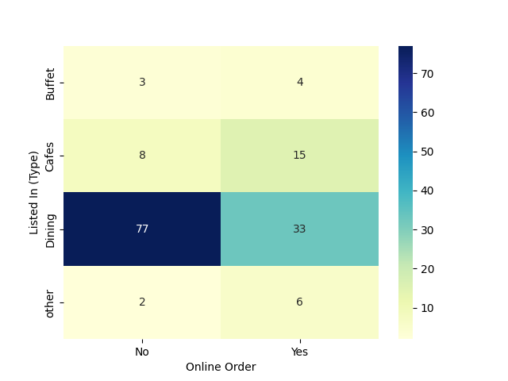

# Zomato_Data_Visualisation_and_Analysis


## Overview
Conducted comprehensive data analysis of Zomato restaurant listings using Python to uncover valuable insights into dining trends, pricing patterns, and customer preferences. Leveraged data visualization techniques to transform raw restaurant data into actionable business intelligence, demonstrating strong analytical capabilities and proficiency in Python's data science stack.

**Zomato Restaurants dataset:** Zomato-data.csv


**1. Importing necessary Python libraries**
```python
import pandas as pd
import numpy as np
import matplotlib.pyplot as plt
import seaborn as sns
```

**2. Creating the data frame**
```python
df = pd.read_csv("zomato-data.csv")          
df.head()
```


**3. Data Cleaning and Preparation**
```python
df.dtypes
```


```python
# Convert the rate column to float after removing / and the denominator.
def transform_rate(v):
    v=str(v).split('/')
    v=v[0]
    return float(v)

df['rate']=df['rate'].apply(transform_rate)
df.head()
```


```python
# Getting summary of the DataFrame.
df.info()
```


Conclusion: There is no null value in the DataFrame.

**4. Exploring Restaurant Types**

```python
# Analyzing the listed_in(type) to identify the popular restaurant categories.
sns.countplot(x=df['listed_in(type)'])
plt.xlabel("Types of Restaurant")
```


Conclusion : The majority of restaurants falls under Dining category.

```python
# Counted the number of votes by Restaurant Type
grouped_data=df.groupby('listed_in(type)')['votes'].sum() 
result=pd.DataFrame({'votes':grouped_data})
result  
```


```python
# Create a line plot for the result.
plt.plot(result,c='green',marker='o')
plt.xlabel('Types of Restaurant',c='red',size=20)
plt.ylabel('Total number of votes ',c='red',size=20)
plt.title('Line Plot for Total number of votes per category',size =20, pad =30)
```


Conclusion: Dining Restaurants are preffered by a large number of individuals.

**5. Identify the most voted restaurant**

```python
# Find the restaurant with the highest number of votes.
max_votes=df['votes'].max()
restaurant_with_max_votes=df.loc[df['votes']==max_votes,'name']
restaurant_with_max_votes
```


**6.Online Order Availability**

```python
# Exploring the online_order column to see how many restaurants accept online.
sns.countplot(x=df['online_order'])
```


Conclusion: This suggests that a majority of restaurants do not accept onine orders.

**7. Analyze Rating**

```python
plt.hist(df['rate'], bins=5)
plt.title('Rating_Distribution',size =20 , pad =30)
plt.show()
```


Conclusion: Majority of restaurants recieved ratings ranging from 3.5 to 4.5.

**8. Approximate cost for couples**

```python
# Analyze the approx_cost(for two people) column to find the preffered price range.
couple_data=df['approx_cost(for two people)']
sns.countplot(x=couple_data)
```


Conclusion: The majority of couples prefer restaurant with an approximate cost of 300 rupees.

**9. Rating Comparisions - Online Vs Offline Orders**

```python
# Compare Rating of Restaurants that accept online order and those that don't.
plt.figure (figsize=(6,6))
sns.boxplot(x='online_order',y='rate', data =df)
```


Conclusion: Offline orders recieved lower rating in comparision to online orders which obtained excellent rating..

**10. Order Mode Preferences by Restaurant Type**

```python

# Find the relationship between order mode(online_order) and restaurant type(listed_in(type)).

pivot_table =df.pivot_table(
   index='listed_in(type)',
   columns='online_order',
   aggfunc='size', 
   fill_value=0)

# Visualising the pivot_table using heatmap
sns.heatmap(pivot_table, annot=True, cmap='YlGnBu', fmt='d')
plt.xlabel('Online Order')
plt.ylabel('Listed In (Type)')
plt.show()
```


Conclusion:◦	Analyzed customer ordering behavior across restaurant types using pivot tables and heatmaps, revealing that 70% of Dining Restaurants do not offer online orders, recommended digital onboarding and delivery integration..